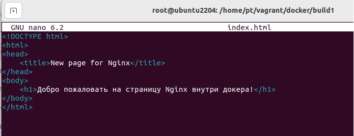

# homework-docker

Описание домашнего задания
---
1. Установить Docker на хост машину
2. Установить Docker Compose - как плагин, или как отдельное приложение
3. Создайть свой кастомный образ nginx на базе alpine. После запуска nginx должен отдавать кастомную страницу (достаточно изменить дефолтную страницу nginx)
4. Определить разницу между контейнером и образом
5. Ответить на вопрос: Можно ли в контейнере собрать ядро?

ОС для настройки: ubuntu 22_04

---
- Этап 1: Установить Docker на хост машину


В методичке есть статья, там нормально описано, как можно установить 
https://docs.docker.com/engine/install/ubuntu/


---
- Этап 2: Установить Docker Compose - как плагин, или как отдельное приложение

Тут в целом тоже ничего сложного


---
- Этап 3: Создайть свой кастомный образ nginx на базе alpine. После запуска nginx должен отдавать кастомную страницу (достаточно изменить дефолтную страницу nginx)


**Создаем Dockerfile**

```bash
# Используем официальный образ nginx на базе Alpine
FROM nginx:alpine

# Копируем кастомный файл индекс.html в каталог nginx
COPY index.html /usr/share/nginx/html/
``` 


**Создаем index.html**

```bash
<!DOCTYPE html>
<html>
<head>
    <title>Кастомная страница Nginx</title>
</head>
<body>
    <h1>Добро пожаловать на кастомную страницу Nginx!</h1>
</body>
</html>
``` 




**Собираем образ**

```bash
docker build -t nginx-otus .
``` 


**Запускаем контейнер и проверяем**

```bash
docker run -d -p 8088:80 nginx-otus
# 8088 - порт хостовой машины
``` 


**Дополнительные полезные коменды**

**Смотрим логи по ID**

```bash
docker logs fdb387aa1b2e
``` 


**Смотрим информацию по запущенному контейнеру**

```bash
docker inspect fdb387aa1b2e
``` 


**Проваливаемся в докер для выполнения команд внутри**

```bash
docker exec -it fdb387aa1b2e
# Тут не хватает команды
``` 


```bash
docker exec -it fdb387aa1b2e bash
# Тут говорит, что bash не установлен
``` 


```bash
docker exec -it fdb387aa1b2e sh
# Тут ок, провалились, посмотрели версию nginx внутри докера
# Выйти потом через exit
``` 


---
- Этап 4: Определить разницу между контейнером и образом

Ну вообще, образ и контейнер это разные сущности..

Образ - это некий шаблон, на основе (или с помощью) которого создается контейнер. Внутри образа есть инструкции и файлы для запуска. Если что-то с контейнером пошло не так, можно создать новый из того-же самого образа

Контейнер - это уже запущенный экземпляр образа. он содержит файлы и зависимости и именно в контейнере крутится сервис (или несколько в теории), ради которого поднимался контейнер. 

Если прям совсем топорно, то Образ - это лекало, а контейнер - это изделие. Конкретное лекало одно, с его помощью можно сделать много одинаковых изделий. 


---
- Этап 5: Ответить на вопрос: Можно ли в контейнере собрать ядро?

Вообще, можно. На лекции показывалось, что в контейнере можно убунту развернуть, и, логично предположить, что и ядро собрать тоже получится

Только вот просторы интернета подсказывают, что процесс этот не очень быстрый и тяжелый в отношении ресурсов хоста, поэтому я бы задумался, а не теряется ли смысл контейнера - как чего-то быстрого и легкого. Нам показывали разницу между ВМ и контейнерами на первом слайде, основное отличие - нет прослойки в виде ОС. А в варианте сборки внутри образа ОС эта прослойка снова появляется...

Но при желании, или для теста, механизм будет примерно такой:


В Dockerfile используем образ убунты

Устанавливаем зависимости

Клонируем репозиторий ядра

собираем ядно

```bash
# Используем официальный образ Ubuntu
FROM ubuntu:latest

# Устанавливаем необходимые инструменты и зависимости
RUN apt-get update && \
    apt-get install -y build-essential libncurses-dev bison flex libssl-dev libelf-dev

# Клонируем репозиторий ядра Linux
RUN git clone https://github.com/torvalds/linux.git

# Переходим в каталог ядра и собираем его
WORKDIR linux
RUN make defconfig && \
    make -j$(nproc)
``` 
